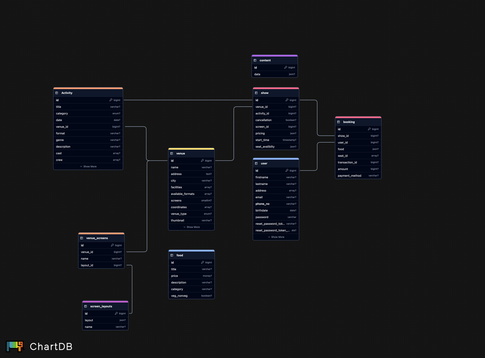

# The NextShow - Ticket Booking Platform

## Overview

The **NextShow** is an online ticket booking platform inspired by BookMyShow. It enables users to book tickets for movies, plays, and music events. The primary goal of this app is to enhance the traditional ticket-booking process by offering a user-friendly interface supported by a strong backend system.

This project was developed with a focus on creating a smooth and secure booking experience, with features such as event search, filtering, sorting, and secure payment options.

## Technologies Used


## ✨ Content:

1. [Getting Started](#getting-started)
2. [Features](#features)
3. [Database](#database)
4. [Tech Stack](#tech-stack)

## 🏃🏻‍♂️ Getting Started :

## Installation

1. Clone the repository:
   ```bash
   git clone https://github.com/username/spring-api-backend.git
   ```

2. Navigate to the project directory:
   ```bash
   cd nextshow
   ```

3. Install dependencies using Maven:
    - For Maven:
      ```bash
      mvn install
      ```


4. Set up the application properties in `src/main/resources/application.properties`(e.g., database configurations, server port, etc.).

5. Start the application:
   ```bash
   mvn spring-boot:run
   ```

## Features

- **Event Management:** Allows users to search, filter, and sort various events like movies, plays, and concerts.
- **Ticket Booking:** Enables users to select seats and book tickets.
- **User Authentication:** Secure login and registration implemented using Spring Security.
- **Payment Integration:** Stripe payment gateway integration for secure transactions.
- **CRUD Operations:** Full CRUD operations for managing events, users, and bookings.
- **Data Paging & Sorting:** Optimized data handling with Spring Data JPA specifications.


## 🚀 Tech Stack


- **Backend:** Spring Boot
- **Database:** PostgreSQL (PSQL)
- **API Testing:** Postman
- **Payment Gateway:** Stripe
- **Authentication & Authorization:** Spring Security
- **Database ORM:** Spring Data JPA
- **Build Tool:** Maven


## 🌈 database:





## 😇 Contact

<a href="mailto:swarupjagtap.bl@gmail.com"></a> <a href="http://in.linkedin.com/in/swarupj">